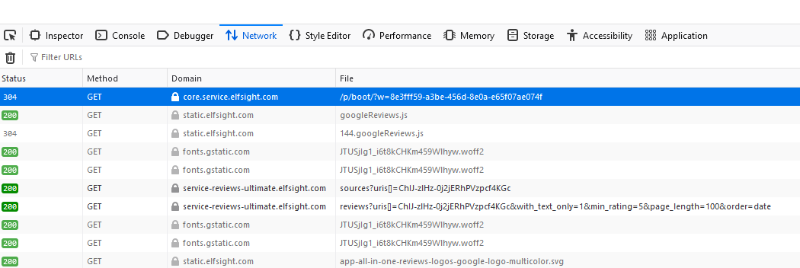

How to update:
1. Browse to the use_this_to_get_updated_json.html by double clicking it (so that it loads from file instead of internet)
- Loading from internet will increment the views count.
2. Extract the json response from the /boot url
3. Update the json values
```json
						"display_free_link": false, <----
						"display_free_link_remove": true, <----
						"free_link_anchor": "Free Google Reviews widget",
						"free_link_url": "https://elfsight.com/google-reviews-widget/?utm_source=websites&utm_medium=clients&utm_content=google-reviews&utm_term=%website_domain%&utm_campaign=free-widget",
						"free_link_remove_url": "https://dash.elfsight.com/apps/google-reviews/pricing?claim=removeBranding&claim=removeBranding"

```



1. Click on response
2. Right click data and save
